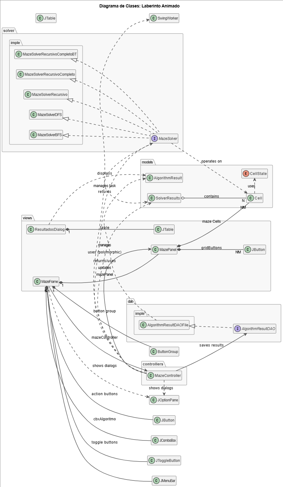

# UNIVERSIDAD POLITÉCNICA SALESIANA
## PROYECTO FINAL - RESOLUCIÓN DE LABERINTO

### 📌 Información General
- **Asignatura:** Estructura de Datos.
- **Estudiante 1:** Brandon Collaguazo
- **Correos:** bcollaguazos@est.ups.edu.ec
- **Estudiante 2:** Carlos Cajas
- **Correos:** ccajast@est.ups.edu.ec
- **Carrera:** Computación.
- **Fecha:** 28/07/2025
- **Profesor:** Pablo Torres

---

### 📄 Índice
1. Introducción
2. Objetivos
    
    2.1. Objetivo General

    2.2. Objetivo Específico

3. Marco Teórico

    3.1. Descripción del proyecto

    3.2. Funcionamiento

    3.3. Estructura de Carpetas y Paquetes

   3.4. Componentes de Interfaz de Usuario (Swing)

    3.4. Diagrama de Clases

4. Conclusiones
5. Recomendaciones
6. Aportes individuales

---

### 📘 Introducción

El proyecto "Resolución de Laberintos" es una aplicación interactiva 
desarrollada en Java Swing diseñada para explorar y visualizar el fascinante 
mundo de los algoritmos de búsqueda de rutas. A través de una interfaz gráfica 
intuitiva, los usuarios pueden crear y personalizar laberintos, para luego 
observar en tiempo real cómo diferentes algoritmos, como BFS y DFS, encuentran 
la solución. Este proyecto no solo sirve como una herramienta práctica para la 
resolución de laberintos, sino que también funciona como un recurso educativo 
clave para comprender la lógica y el rendimiento de estos algoritmos fundamentales 
en la ciencia de la computación.

### 🎯 Objetivo:

**Objetivo General**

Desarrollar una aplicación interactiva en Java Swing que permita la 
creación y edición dinámica de laberintos, y que visualice de forma 
animada el proceso de búsqueda de rutas mediante la implementación 
de diversos algoritmos de pathfinding, registrando y presentando sus 
métricas de rendimiento.

**Objetivos Específicos**

- Desarrollar una GUI intuitiva para la creación y edición interactiva 
de laberintos.
- Integrar múltiples algoritmos de pathfinding para la resolución de 
laberintos.
- Implementar una visualización animada y fluida de los algoritmos de 
búsqueda.
- Registrar y persistir las métricas de rendimiento de cada algoritmo 
ejecutado.
- Establecer una arquitectura de software modular y bien organizada.

---

### 🧠 Marco Teórico

**Descripción del Proyecto**
Este proyecto es una aplicación Java Swing que permite crear laberintos 
personalizables y visualizar de forma animada cómo diversos algoritmos 
de búsqueda de rutas los resuelven. La aplicación destaca por su 
animación fluida del proceso de pathfinding, lo que facilita la 
comprensión de los algoritmos. Además, registra y compara las métricas 
de rendimiento de cada solución encontrada.

**Funcionamiento**

La aplicación sigue un flujo de trabajo intuitivo:
- **Creación y Edición del Laberinto:** El usuario define las dimensiones 
del laberinto y lo edita interactivamente marcando celdas de inicio, 
fin y paredes.
- **Selección de Algoritmo:** Se elige un algoritmo de búsqueda de rutas 
desde un menú desplegable.
- **Resolución Animada:** Al iniciar la resolución, un SwingWorker 
ejecuta el algoritmo en segundo plano. A medida que el algoritmo 
avanza, envía actualizaciones a la interfaz de usuario para colorear 
las celdas visitadas y el camino final de forma fluida y animada, 
sin bloquear la aplicación.
- **Registro de Resultados:** Una vez completada la búsqueda y animación, 
se registran métricas como el tiempo de ejecución y los pasos, que 
pueden ser consultados posteriormente.

**Estructura**

El proyecto está organizado en una estructura de paquetes lógica para 
facilitar su modularidad y mantenimiento:

- **controllers/:** Contiene la lógica principal y la orquestación de la aplicación.

- **dao/:** Maneja el acceso a datos y la persistencia de resultados.

- **models/:** Define las estructuras de datos clave del proyecto.

- **solver/:** Aloja las interfaces y las implementaciones de los algoritmos de resolución de laberintos.

- **views/:** Contiene todos los componentes de la interfaz de usuario.

- **resources/:** (Opcional) Para recursos adicionales como imágenes o configuraciones.

Esta organización promueve la separación de responsabilidades y la claridad del código.

**Componentes de Interfaz de Usuario (Swing)**

La interfaz gráfica de usuario (GUI) ha sido construida utilizando componentes estándar de 
Java Swing para una interacción intuitiva. Los elementos clave incluyen:

* **`JFrame`**: La ventana principal de la aplicación.
* **`JPanel`**: Utilizados para la organización visual y como lienzo para el laberinto (`MazePanel`).
* **`JMenuBar`**: Provee las opciones de menú de la aplicación.
* **`JToggleButton`**: Para seleccionar modos de edición de celda (inicio, fin, pared).
* **`JButton`**: Utilizados para las celdas del laberinto y botones de acción (ej. resolver).
* **`JComboBox`**: Permite la selección del algoritmo de búsqueda.
* **`JOptionPane`**: Para mensajes interactivos al usuario (ej. errores, entradas).
* **`JDialog` / `JTable`**: Para mostrar los resultados de las ejecuciones en una tabla separada.

**Diagrama de Clases**

---

### ✍️ Conclusiones

El proyecto "Resolución de Laberintos" integra exitosamente una GUI interactiva 
con algoritmos de búsqueda de rutas. Se logró una visualización animada y 
fluida, crucial para comprender el funcionamiento de los algoritmos 
sin bloquear la interfaz. La modularidad del diseño y el registro de 
resultados demuestran una sólida comprensión de estructuras de datos, 
algoritmos y concurrencia en Swing.

**Conclusión (Estudiante 1: Brandon Collaguazo)**
"En mis pruebas, el algoritmo BFS (Breadth-First Search) resultó ser el más óptimo 
para encontrar el camino más corto en los laberintos. Aunque suele visitar más celdas, 
su método de expansión por niveles asegura que la primera ruta encontrada al objetivo 
sea siempre la de menor número de pasos. Esto lo hace ideal cuando la prioridad es la 
longitud mínima del camino."

**Conclusión (Estudiante 2: Carlos Cajas)**
"Mi análisis indica que DFS (Depth-First Search) y sus variantes recursivas son a menudo 
más rápidos para encontrar cualquier camino en el laberinto. Su estrategia de exploración 
profunda permite hallar una solución de forma veloz si el camino es directo, con la ventaja 
de un menor consumo de memoria. Sin embargo, no garantiza que el camino encontrado sea el más corto."

---

### 💡 Recomendaciones

- Optimizar el rendimiento para laberintos de gran tamaño.
- Implementar generación aleatoria de laberintos.
- Añadir más algoritmos de búsqueda (ej. A*, Dijkstra).
- Ofrecer control granular sobre la velocidad de la animación.
- Considerar una solución de persistencia de datos más robusta.
- Mejorar la estética y usabilidad de la interfaz de usuario.
